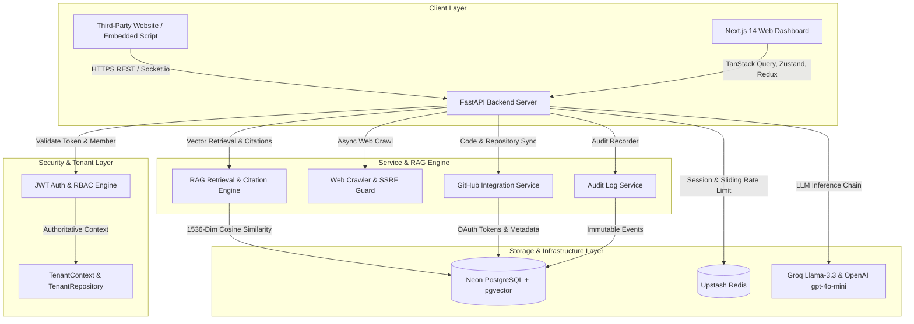
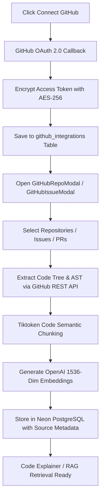

# 🚀 SupportAI Platform - A to Z Master System Architecture & Complete Flow Documentation

**Document Version:** 5.0.0  
**Last Updated:** August 2026  
**Git Branch:** `main`  
**System Status:** Fully Operational, Optimized & Production-Ready (Multi-Tenant RBAC, RAG Citation Engine, GitHub Integration Ecosystem & Production Hardened)

---

## 📋 Table of Contents
1. [Executive Summary & System Purpose](#1-executive-summary--system-purpose)
2. [Comprehensive Feature Catalog & Platform Capabilities](#2-comprehensive-feature-catalog--platform-capabilities)
   - [🏢 Multi-Tenant SaaS Engine & Tenant Data Isolation](#-multi-tenant-saas-engine--tenant-data-isolation)
   - [🛡️ Role-Based Access Control (RBAC 5-Role Matrix)](#️-role-based-access-control-rbac-5-role-matrix)
   - [🐙 GitHub Developer Ecosystem & Code Intelligence](#-github-developer-ecosystem--code-intelligence)
   - [📚 AI RAG Vector Knowledge Base & Grounded Citations](#-ai-rag-vector-knowledge-base--grounded-citations)
   - [🎨 AI Widget Configuration Studio](#-ai-widget-configuration-studio)
   - [💬 Floating Support Chat Widget & Live Operator Inbox](#-floating-support-chat-widget--live-operator-inbox)
   - [🔒 Production Security, Audit Logging & Rate Limiting](#-production-security-audit-logging--rate-limiting)
   - [💳 Stripe Billing & Monthly Quota System](#-stripe-billing--monthly-quota-system)
3. [End-to-End System Data Flows & Architecture Diagrams](#3-end-to-end-system-data-flows--architecture-diagrams)
   - [Flow 1: User Registration, Authentication & Multi-Tenant Authorization](#flow-1-user-registration-authentication--multi-tenant-authorization)
   - [Flow 2: 8-Stage RBAC & Scoped Tenant Data Pipeline](#flow-2-8-stage-rbac--scoped-tenant-data-pipeline)
   - [Flow 3: GitHub Integration, OAuth Encryption & Code Vectorization](#flow-3-github-integration-oauth-encryption--code-vectorization)
   - [Flow 4: Knowledge Ingestion, Web Crawling & Vector Embedding](#flow-4-knowledge-ingestion-web-crawling--vector-embedding)
   - [Flow 5: Grounded RAG Vector Search, LLM Inference & Citations](#flow-5-grounded-rag-vector-search-llm-inference--citations)
   - [Flow 6: Live Operator Handoff & Session Takeover](#flow-6-live-operator-handoff--session-takeover)
   - [Flow 7: Stripe Billing, Webhooks & Quota Enforcement](#flow-7-stripe-billing-webhooks--quota-enforcement)
4. [Complete Technology Stack & Ecosystem](#4-complete-technology-stack--ecosystem)
5. [Frontend App Router Structure & Pages](#5-frontend-app-router-structure--pages)
6. [AI Widget Configuration Studio Architecture](#6-ai-widget-configuration-studio-architecture)
7. [Modular Component Suite (Chat, GitHub & RBAC)](#7-modular-component-suite-chat-github--rbac)
8. [Frontend State & Zero-Flash Hydration Architecture](#8-frontend-state--zero-flash-hydration-architecture)
9. [Complete Backend REST API Endpoint Map](#9-complete-backend-rest-api-endpoint-map)
10. [PostgreSQL Schema, Models & Vector Indexes](#10-postgresql-schema-models--vector-indexes)
11. [Verification Checklist & Automated Pytest Test Suites](#11-verification-checklist--automated-pytest-test-suites)

---

## 1. Executive Summary & System Purpose

**SupportAI Platform** is an enterprise-grade, multi-tenant AI Customer Support and Knowledge Base platform built using Next.js 14 (App Router), FastAPI, Neon PostgreSQL (with `pgvector` extension), Upstash Redis, Cloudinary, OpenAI / Groq LLMs, and GitHub REST API v3 integrations.

The platform enables businesses to ingest company documentation (PDFs, DOCX, TXT, MD files), crawl entire website domains, and connect GitHub repositories (source code, issues, PRs). Vector embeddings (1536-dimensional) are stored in Neon PostgreSQL to power real-time, grounded, hallucination-free AI support answers complete with exact inline citations. If queries require human escalation, operators can perform **Live Session Takeover** from the Operator Inbox via Socket.io real-time streaming.

---

## 2. Comprehensive Feature Catalog & Platform Capabilities

### 🏢 Multi-Tenant SaaS Engine & Tenant Data Isolation
- **Multi-Tenant Hierarchy**: `Business` (Organization) $\rightarrow$ `Workspace` entity relationship where all data, conversations, members, and vector embeddings are isolated per `workspace_id`.
- **Authoritative `TenantContext`**: Server-validated context derived strictly from authenticated JWT sessions and database memberships (eliminates parameter spoofing).
- **Centralized `TenantRepository`**: Scoped database operations (`get_one_scoped`, `list_scoped`, `insert_scoped`, `update_scoped`, `delete_scoped`) enforcing zero cross-tenant data leakage.
- **Organization Switcher**: Top header organization/workspace switcher with state hydration.

### 🛡️ Role-Based Access Control (RBAC 5-Role Matrix)
- **5-Role Access Matrix**:
  - **`Owner`**: Full organization control, billing management, team role changes (`*`).
  - **`Admin`**: Organization management, team invites, knowledge base, and widget configuration.
  - **`Manager`**: Support team management, conversation assignment, team read, and analytics.
  - **`Agent`**: Inbound customer response, conversation assignment, and resolution.
  - **`Viewer`**: Read-only access across dashboard analytics, conversations, and settings.
- **Granular Permissions**: Defined backend permissions (`conversations:reply`, `knowledge:manage`, `team:invite`, `billing:manage`, `github:connect`).
- **Declarative Frontend Gating**: `<Can permission="...">` component ([Can.tsx](file:///d:/ashif/Resume%20Projects/AI-Support-Platform/apps/web/src/components/auth/Can.tsx)) and `usePermissions()` hook ([usePermissions.ts](file:///d:/ashif/Resume%20Projects/AI-Support-Platform/apps/web/src/hooks/usePermissions.ts)) dynamically filtering UI controls and sidebar navigation.
- **Token-Based Team Invites**: Secure 7-day single-use email invitation links (`/invite/[token]`) with privilege escalation protection.

### 🐙 GitHub Developer Ecosystem & Code Intelligence
- **OAuth & Encrypted Token Storage**: OAuth 2.0 flow storing GitHub access tokens encrypted with AES-256 in PostgreSQL (`GitHubConnectionCard.tsx`).
- **Repository Code Ingestion**: Select GitHub repositories, branches, and file extensions for vector indexing (`GitHubRepoModal.tsx`).
- **Issues & PR Ingestion**: Filter GitHub Issues and Pull Requests by state (`open`, `closed`, `all`) and labels for knowledge extraction (`GitHubIssueModal.tsx`).
- **AI Code Explainer Engine**: Deep AST analysis, architectural component breakdown, and automated developer documentation (`CodeExplainerModal.tsx`).
- **Background Sync & Webhooks**: Celery worker synchronization and real-time webhook listeners (`github_sync_service.py`, `github_webhook_service.py`).

### 📚 AI RAG Vector Knowledge Base & Grounded Citations
- **Multi-Format Ingestion**: Process PDF, DOCX, TXT, MD files uploaded to Cloudinary.
- **Tiktoken Semantic Chunking**: Auto-splits text into 250-token semantic chunks with 30-token overlap (`chunker_service.py`).
- **1536-Dim Vector Embeddings**: Generates embeddings via OpenAI `text-embedding-3-small` in Neon PostgreSQL `pgvector`.
- **Grounded Citation Engine**: Formats AI responses with exact source metadata, document names, line ranges, and URL references (`citation_service.py`).
- **Async Web Crawler**: Domain crawler (`crawler_service.py`) with SSRF Guard (`ssrf_guard.py`) preventing access to private IP ranges.

### 🎨 AI Widget Configuration Studio (`/dashboard/widget`)
- **2-Column Responsive Studio**: Form controls on left, `sticky top-6` Live Preview Studio on right.
- **Device Frame Switcher**: Desktop and Mobile container preview (`[ Desktop ] [ Mobile ]`).
- **Brand Identity & Presets**: Logo uploader, tagline editor, and accent color presets (Gold `#D4AF37`, Royal Blue `#3B82F6`, Emerald `#10B981`, Purple `#8B5CF6`, Rose `#F43F5E`).
- **Quick Action Suggestions**: Add up to 4 prompt suggestion cards.
- **One-Click Script Generator**: Copy HTML, React, and Next.js embedding snippets.

### 💬 Floating Support Chat Widget & Live Operator Inbox
- **Lightweight Script Embed**: Single-line `<script>` embedding for external sites (`embed.js`).
- **Staggered Typing Indicator**: CSS pulse animation (`●  ●  ●`) during LLM generation.
- **Structured Markdown & Code Formatting**: Markdown rendering with copy-to-clipboard code blocks.
- **Live Operator Handoff**: 1-click **Take Over Conversation** transitioning session from AI bot to human support agent.
- **Socket.io Real-Time Streaming**: Instant bi-directional message dispatch between visitors and operators.

### 🔒 Production Security, Audit Logging & Rate Limiting
- **Structured Audit Logging**: Persists immutable `AuditLog` records for critical workspace actions (`audit_service.py`).
- **Redis Rate Limiting**: Enforces rate limits on Auth (5 req/min), Invites (10 req/min), and AI Chat (30 req/min) returning `HTTP 429`.
- **Deactivated Session Revocation**: Immediate API key and session revocation (`HTTP 403`) upon member deactivation.

### 💳 Stripe Billing & Monthly Quota System
- **Tiered Subscriptions**: `Free` (1,000 msgs/mo), `Starter` ($49/mo, 10,000 msgs/mo), `Enterprise` ($199/mo, 100,000 msgs/mo).
- **Stripe Webhook Ingestion**: Subscription status tracking via `/billing/webhook`.
- **Monthly Limit Enforcement**: Automatic visitor notification and escalation when quota is reached.

---

## 3. End-to-End System Data Flows & Architecture Diagrams



---

### Flow 1: User Registration, Authentication & Multi-Tenant Authorization

1. **Authentication Request**: User logs in on `/login` or via Google OAuth (`/auth/google/callback`).
2. **JWT Issuance**: FastAPI verifies credentials and returns cryptographically signed JWT.
3. **Redux State Sync**: Client stores token in Redux `authSlice` and synchronized `localStorage`.
4. **Header Injection**: Requests include `Authorization: Bearer <token>` and `X-Workspace-Id: <active_workspace_id>`.

### Flow 2: 8-Stage RBAC & Scoped Tenant Data Pipeline

```text
Incoming HTTP Request
  │
  ├── 1. Authentication Middleware (Verify JWT token signature)
  ├── 2. Identify Authenticated User (Extract user_id)
  ├── 3. Identify Target Workspace (Extract workspace_id header)
  ├── 4. Load Membership Record (Query team_members for user role)
  ├── 5. Enforce RBAC Permission (Verify require_permission check)
  ├── 6. Instantiate TenantContext (Derived strictly from verified membership)
  ├── 7. Execute TenantRepository Query (SQL query enforced with WHERE workspace_id = ...)
  └── 8. Return Scoped Response (Zero cross-tenant data leakage)
```

### Flow 3: GitHub Integration, OAuth Encryption & Code Vectorization



### Flow 4: Knowledge Ingestion, Web Crawling & Vector Embedding

1. **Upload / Submit URL**: User uploads PDF/DOCX or submits domain URL in `/dashboard/knowledge`.
2. **SSRF Guard Validation**: `ssrf_guard.py` checks URL against internal network ranges (prevents intranet exploitation).
3. **Content Parsing**: `file_extractor_service.py` or `crawler_service.py` extracts raw text.
4. **Semantic Chunking**: `chunker_service.py` splits text into 250-token blocks with 30-token overlap.
5. **Vector Generation**: `embedding_service.py` calls OpenAI `text-embedding-3-small`.
6. **Database Persistence**: Embeddings saved into Neon PostgreSQL `knowledge_chunks`.

### Flow 5: Grounded RAG Vector Search, LLM Inference & Citations

1. **Visitor Inquiry**: Visitor submits question in floating widget.
2. **Vector Similarity Search**: Backend converts query to 1536-dim embedding and executes Cosine Similarity search in PostgreSQL (`1 - (embedding <=> query_vector)`).
3. **Context Assembly & Grounding**: RAG prompt engine (`rag_prompt_service.py`) builds context with system rules and strict anti-hallucination guardrails.
4. **LLM Inference Candidate Fallback Chain**:
   - **Candidate 1**: Groq API `llama-3.3-70b-versatile` (~300 tokens/sec)
   - **Candidate 2**: Groq API `llama-3.1-8b-instant`
   - **Candidate 3**: OpenAI API `gpt-4o-mini`
5. **Citation Generation**: `citation_service.py` maps response facts to specific source chunks and attaches grounded citations.

### Flow 6: Live Operator Handoff & Session Takeover

1. **Escalation Trigger**: Low vector confidence or customer request triggers handoff state.
2. **Status Change**: Conversation status set to `"human"`; Socket.io broadcasts `conversation:status_changed`.
3. **Inbox Alert**: Live Operator Inbox (`/dashboard/inbox`) displays real-time notification alert.
4. **Agent Takeover**: Operator clicks **Take Over Conversation**, pausing AI responses and enabling direct agent chat.

### Flow 7: Stripe Billing, Webhooks & Quota Enforcement

1. **Plan Upgrade**: User selects Starter ($49/mo) or Enterprise ($199/mo) plan $\rightarrow$ FastAPI creates Stripe Checkout session.
2. **Webhook Ingestion**: Stripe fires webhook to `/billing/webhook`, updating `subscriptions` table.
3. **Quota Validation**: Rate limiter validates monthly limit; notifies visitor when quota is exhausted.

---

## 4. Complete Technology Stack & Ecosystem

| Layer | Technology | Version | Key Purpose |
| :--- | :--- | :--- | :--- |
| **Frontend Framework** | Next.js (App Router) | 14.x | Server-Side Rendering, App Router, Dynamic Routes |
| **UI Components & Icons** | React & Lucide React | 18.x / 0.400+ | Component architecture & modern vector icons |
| **Styling Engine** | Vanilla CSS & Tailwind Utilities | Custom | Custom design system, glassmorphism & dark mode |
| **Server State Management**| TanStack Query | v5.x | Data fetching, cache invalidation & prefetching |
| **Client State Management**| Zustand & Redux Toolkit | v4.x / v2.x | UI state, auth tokens & workspace switcher |
| **Backend API Framework** | Python & FastAPI | 3.11 / 0.110+ | High-performance async REST API endpoints |
| **Relational Database** | Neon PostgreSQL | 16.x | Serverless Postgres & `pgvector` vector storage |
| **ORM & Async Driver** | SQLAlchemy & Asyncpg | 2.0.x / 0.29+ | Async database ORM and non-blocking queries |
| **Cache & Rate Limiting** | Upstash Redis | Serverless | Token bucket rate limiting & vector query cache |
| **Cloud Media Storage** | Cloudinary | API v2 | Document and image storage |
| **Integrations Ecosystem** | GitHub REST API v3 | REST v3 | Code repository, issues & PR sync engine |
| **LLM Inference Engine** | Groq & OpenAI APIs | Latest | Llama-3.3-70b, Llama-3.1-8b, gpt-4o-mini |
| **Vector Embeddings** | OpenAI Embeddings | `text-embedding-3-small` | 1536-dimensional floating point vectors |
| **Automated Testing** | Pytest & Asyncio | 8.x | 28 full suite unit, integration & security tests |

---

## 5. Frontend App Router Structure & Pages

```text
apps/web/src/app/
 ├── (auth)/                    # Auth Route Group
 │    ├── login/                # Login Page
 │    ├── signup/               # Signup Page
 │    ├── callback/             # Email Auth Callback
 │    └── google/callback/      # Google OAuth Callback
 ├── (dashboard)/               # Authenticated Dashboard Layout Group
 │    ├── layout.tsx            # Shell with RBAC Navigation Sidebar & Header Switcher
 │    └── dashboard/
 │         ├── page.tsx         # Executive Analytics & Overview Summary
 │         ├── inbox/           # Live Operator Inbox & Session Takeover
 │         ├── knowledge/       # Knowledge Base (Uploads, Crawling & GitHub Sync)
 │         ├── widget/          # AI Widget Configuration Studio (2-Column Sticky)
 │         ├── analytics/       # Performance Metrics & Question Frequency
 │         ├── team/            # Team Members, Roles & Invitation Management
 │         ├── billing/         # Subscription Plans & Quota Management
 │         └── settings/        # API Key Generator & Workspace Settings
 ├── onboarding/                # Multi-Step Business Onboarding Wizard
 └── invite/[token]/            # Team Member Invitation Acceptance Page
```

---

## 6. AI Widget Configuration Studio Architecture
{{ ... }}
└───────────────────────────────┴────────────────────────────┘

---

## 7. Modular Component Suite (Chat, GitHub & RBAC)

```text
src/components/
 ├── auth/
 │    └── Can.tsx               # RBAC UI boundary component (<Can permission="...">)
 ├── chat/
 │    ├── AssistantAvatar.tsx   # Avatar with online indicator
 │    ├── ChatHeader.tsx        # Widget header & reset confirmation modal
 │    ├── ChatTypingIndicator.tsx # Staggered 3-dot CSS pulse animation
 │    ├── ChatMessageItem.tsx   # Markdown bubble, code copy & grounded citations
 │    ├── ChatQuickSuggestions.tsx # Quick prompt suggestion cards
 │    └── ChatInputArea.tsx     # Auto-resizing textarea with Stop/Send control
 └── github/
      ├── GitHubConnectionCard.tsx # OAuth status card, token indicator & sync controls
      ├── GitHubRepoModal.tsx      # Repository selection modal & branch filters
      ├── GitHubIssueModal.tsx     # Issue & PR ingestion modal with label tagging
      └── CodeExplainerModal.tsx   # AI Code analysis modal & documentation generator
```

---

## 8. Frontend State & Zero-Flash Hydration Architecture

- **Zero Default-Value Flash**: `<WidgetSetupSkeleton />` prevents uninitialized form defaults from flashing on screen.
- **Declarative UX Permission Guarding**: `usePermissions` hook provides `can(permission)` checks alongside role flags (`isOwner`, `isAdmin`, `isManager`, `isAgent`, `isViewer`).
- **Sidebar RBAC Navigation Filtering**: Navigation items are dynamically filtered based on active membership permissions.
- **Link Hover Prefetching**: Prefetches queries on link hover via `queryClient.prefetchQuery`.

---

## 9. Complete Backend REST API Endpoint Map

| Category | Endpoint | Method | Description |
| :--- | :--- | :--- | :--- |
| **Auth** | `/auth/login` | `POST` | User authentication & JWT generation |
| **Auth** | `/auth/signup` | `POST` | User registration |
| **Auth** | `/auth/me` | `GET` | Authenticated user profile |
| **Workspaces** | `/workspaces` | `GET / POST` | List workspaces / Create workspace |
| **Workspaces** | `/workspaces/setup` | `POST` | Setup workspace profile & defaults |
| **Team & Invites** | `/team/members` | `GET` | List workspace members & roles |
| **Team & Invites** | `/team/invites` | `POST` | Send email invitation token |
| **Team & Invites** | `/team/accept-invite` | `POST` | Accept invitation & join workspace |
| **Integrations** | `/integrations/github/auth` | `GET / POST` | GitHub OAuth authorization & token callback |
| **Integrations** | `/integrations/github/repos` | `GET / POST` | List GitHub repos / Trigger code ingestion |
| **Integrations** | `/integrations/github/issues` | `GET / POST` | Fetch GitHub issues / Vectorize issues & PRs |
| **Integrations** | `/integrations/github/explain` | `POST` | Generate AI code explanation & AST analysis |
| **Knowledge** | `/sources/web` | `GET / POST` | List web sources / Crawl domain |
| **Knowledge** | `/sources/files` | `GET / POST` | Upload PDF/DOCX & generate vector embeddings |
| **Conversations** | `/conversations` | `GET` | List workspace customer chat sessions |
| **Conversations** | `/conversations/{id}/messages` | `GET / POST` | Fetch messages / Send operator reply |
| **Conversations** | `/conversations/{id}/assign` | `POST` | Assign agent & trigger live takeover |
| **Public Widget** | `/public/{embed_id}/conversations` | `POST` | Initialize visitor chat session |
| **Public Widget** | `/public/{embed_id}/conversations/{id}/messages` | `GET / POST` | Stream public chat & trigger RAG pipeline |
| **Widget Config** | `/widget/config` | `GET / PATCH` | Fetch / Update widget customization settings |
| **Analytics** | `/analytics/summary` | `GET` | Overview performance metrics |
| **Analytics** | `/analytics/top-questions` | `GET` | Frequent customer inquiry ranking |
| **Settings** | `/settings/api-keys` | `GET / POST` | Manage developer API keys |
| **Billing** | `/billing/subscription` | `GET` | Fetch active plan tier & usage quotas |

---

## 10. PostgreSQL Schema, Models & Vector Indexes

```text
┌──────────────┐     ┌──────────────┐     ┌──────────────┐
│    Users     │────<│ TeamMembers  │>────│  Workspaces  │
└──────────────┘     └──────────────┘     └──────────────┘
                                                  │
                                                  ├──< Business
                                                  ├──< WidgetConfig
                                                  ├──< SourceWeb
                                                  ├──< SourceFile
                                                  ├──< GitHubIntegration
                                                  ├──< KnowledgeChunk (pgvector 1536-dim)
                                                  ├──< Conversation
                                                  │       └──< Message
                                                  ├──< AuditLog (Immutable security log)
                                                  └──< Subscription
```

---

## 11. Verification Checklist & Automated Pytest Test Suites

The backend contains **28 comprehensive automated pytest test suites** verifying multi-tenancy, RBAC, GitHub integrations, RAG retrieval, and production hardening:

1. **`test_phase1_tenant_foundation.py`**: Database multi-tenant foundation & schema migration verification.
2. **`test_phase2_tenant_data_isolation.py`**: Strict cross-tenant isolation and data leakage prevention.
3. **`test_phase3_organization_membership.py`**: Team invitation lifecycle and token validation.
4. **`test_phase4_rbac_foundation.py`**: 5-Role access control matrix unit tests.
5. **`test_phase5_enforce_rbac_backend.py`**: 8-stage authorization pipeline integration tests.
6. **`test_phase8_production_hardening.py`**: Audit logging, Redis rate limiting & deactivated session revocation.
7. **`test_github_phase1_oauth_encryption.py`**: GitHub OAuth token AES-256 encryption unit tests.
8. **`test_github_phase6_8_sync_services.py`**: GitHub repository sync & webhook processing tests.
9. **`test_github_connector_e2e.py`**: End-to-end GitHub connector integration tests.
10. **`test_rag_phase1_knowledge_model.py`**: Knowledge chunk schema & vector index tests.
11. **`test_rag_phase2_ingestion.py`**: File ingestion & Cloudinary document processing tests.
12. **`test_rag_phase3_4_parsers_normalizer.py`**: Document text parsers & text normalizer unit tests.
13. **`test_rag_phase5_6_chunking_embedding.py`**: Tiktoken semantic chunker & OpenAI embedding tests.
14. **`test_rag_phase7_8_retrieval_service.py`**: RAG vector cosine similarity retrieval tests.
15. **`test_rag_phase9_12_prompt_injection.py`**: System prompt injection & safety guardrail tests.
16. **`test_rag_phase13_16_chat_citations_handoff.py`**: Grounded citation formatting & live operator handoff tests.
17. **`test_rag_phase20_25_evaluation_security.py`**: RAG retrieval accuracy & security evaluation tests.
18. **`test_auth.py`**: User authentication, JWT signing & password hashing tests.
19. **`test_workspaces.py`**: Workspace creation, profile setup & switcher tests.
20. **`test_team.py`**: Team member role assignment & management tests.
21. **`test_phase3_onboarding_billing.py`**: Business onboarding & Stripe billing integration tests.
22. **`test_phase4_sources.py`**: Web crawler & file source management tests.
23. **`test_phase5_widget.py`**: AI Widget Studio configuration & preview tests.
24. **`test_phase6_agent.py`**: Agent assignment & session takeover tests.
25. **`test_phase8_analytics.py`**: Overview KPI metrics & top questions query tests.
26. **`test_phase9_settings.py`**: API key generation & rate limiter integration tests.
27. **`test_cache_service.py`**: Redis query caching & TTL invalidation tests.
28. **`test_health.py`**: System health check & database ping tests.

---

