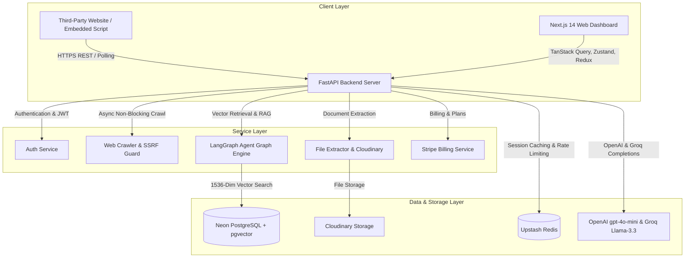
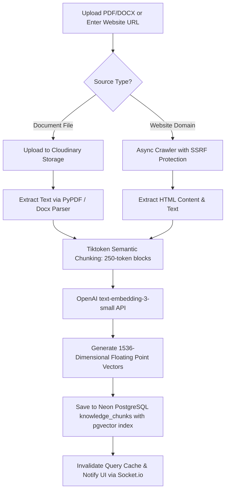

# 🚀 SupportAI Platform - A to Z Master System Architecture & Complete Flow Documentation

**Document Version:** 4.0.0  
**Last Updated:** August 2026  
**Git Commit:** `dd19eb70` (main branch)  
**System Status:** Fully Operational, Optimized & Production-Ready  

---

## 📋 Table of Contents
1. [Executive Summary & System Purpose](#1-executive-summary--system-purpose)
2. [Comprehensive Feature Catalog & Platform Capabilities](#2-comprehensive-feature-catalog--platform-capabilities)
3. [End-to-End System Data Flows & Connection Architecture](#3-end-to-end-system-data-flows--connection-architecture)
   - [Flow 1: User Registration, Authentication & JWT Authorization](#flow-1-user-registration-authentication--jwt-authorization)
   - [Flow 2: Business Onboarding & Automated Workspace Provisioning](#flow-2-business-onboarding--automated-workspace-provisioning)
   - [Flow 3: Knowledge Document Ingestion, Web Crawling & Vector Embedding](#flow-3-knowledge-document-ingestion-web-crawling--vector-embedding)
   - [Flow 4: Third-Party Web Embedding & Public Visitor Chat Session](#flow-4-third-party-web-embedding--public-visitor-chat-session)
   - [Flow 5: RAG Vector Search & Multi-Model Inference Reasoning Pipeline](#flow-5-rag-vector-search--multi-model-inference-reasoning-pipeline)
   - [Flow 6: Live Operator Handoff, Socket.io Broadcast & Session Takeover](#flow-6-live-operator-handoff-socketio-broadcast--session-takeover)
   - [Flow 7: Stripe Billing, Webhook Ingestion & Monthly Quota Enforcement](#flow-7-stripe-billing-webhook-ingestion--monthly-quota-enforcement)
   - [Flow 8: Developer API Key Authentication & Rate Limiting](#flow-8-developer-api-key-authentication--rate-limiting)
4. [Complete Technology Stack & Ecosystem](#4-complete-technology-stack--ecosystem)
5. [Frontend App Router Structure & Pages](#5-frontend-app-router-structure--pages)
6. [AI Widget Configuration Studio Architecture](#6-ai-widget-configuration-studio-architecture)
7. [Modular AI Chat Component Suite](#7-modular-ai-chat-component-suite)
8. [Frontend State & Zero-Flash Hydration Architecture](#8-frontend-state--zero-flash-hydration-architecture)
9. [Complete Backend REST API Endpoint Map](#9-complete-backend-rest-api-endpoint-map)
10. [PostgreSQL Schema, Models & Vector Indexes](#10-postgresql-schema-models--vector-indexes)
11. [Verification Checklist & Git Log](#11-verification-checklist--git-log)

---

## 1. Executive Summary & System Purpose

**SupportAI Platform** is an enterprise-grade, multi-tenant AI Customer Support and Knowledge Base platform built using Next.js 14 (App Router), FastAPI, Neon PostgreSQL (with `pgvector` extension), Upstash Redis, Cloudinary, and OpenAI / Groq LLM architectures.

The platform enables businesses to ingest company documentation (PDFs, DOCX files, TXT documents) and crawl entire website domains, automatically generating 1536-dimensional vector embeddings stored securely in Neon PostgreSQL. Visitors interacting with the embedded floating chat widget receive real-time, grounded, hallucination-free support answers. If queries require human escalation or reach system volume thresholds, human operators can seamlessly perform **Live Session Takeover** from the Operator Inbox.

---

## 2. Comprehensive Feature Catalog & Platform Capabilities

### 🏢 Multi-Tenant Workspace & Organization Management
- **Multi-Tenant Isolation**: Multi-workspace architecture where data, conversations, team members, and knowledge vectors are isolated per `workspace_id`.
- **Role-Based Access Control (RBAC)**: Supports `owner`, `admin`, and `agent` member roles.
- **Team Email Invites**: Generate signed email invitation tokens allowing team members to join existing workspaces (`/invite/[token]`).
- **Workspace Switcher**: Top header workspace switcher with instant active workspace state management.

### 📚 AI RAG Vector Knowledge Base & Document Training (`/dashboard/knowledge`)
- **Document Processing**: Upload company PDF, DOCX, and TXT files to Cloudinary with text extraction.
- **Tiktoken Semantic Chunking**: Auto-splits text into 250-token semantic chunks with a 30-token overlap.
- **1536-Dim Vector Embeddings**: Generates embeddings via OpenAI `text-embedding-3-small` stored in Neon PostgreSQL `pgvector`.
- **Async Web Crawler**: Domain crawler (httpx + BeautifulSoup) with SSRF Guard that extracts pages, parses content, and vectorizes content automatically.

### 🎨 AI Widget Configuration Studio (`/dashboard/widget`)
- **2-Column Responsive Studio**: Scrollable configuration form on left, `sticky top-6` Live Preview Studio on right.
- **Device Frame Switcher**: Switch between Desktop and Mobile preview containers (`[ Desktop ] [ Mobile ]`).
- **Section Navigation Bar**: Smooth-scrolling jump bar (`Brand & Theme`, `Greeting`, `Quick Actions`, `Installation`).
- **Brand Identity & Presets**: Custom Logo Uploader & `AssistantAvatar` fallback, tagline editor, and 1-click curated accent color presets (Gold `#D4AF37`, Royal Blue `#3B82F6`, Emerald `#10B981`, Purple `#8B5CF6`, Rose `#F43F5E`).
- **Quick Action Card Manager**: Add, Edit, Delete up to 4 prompt suggestion cards with capacity tracking (`2 / 4 actions`).
- **One-Click Script Generator**: Copy embedding script tag with tabs for HTML, React, and Next.js.

### 💬 Floating Customer Support Chat Widget (`embed.js`)
- **Single-Line Script Embed**: Lightweight script insertion for third-party websites.
- **Staggered 3-Dot Typing Indicator**: CSS keyframe pulse animation (`●  ●  ●`) for thinking feedback.
- **Structured Markdown & Code Blocks**: Markdown rendering for headers, lists, bold text, and dark code blocks with copy buttons and `✓ Copied` feedback.
- **Compact Assistant Action Bar**: Copy message text, Regenerate response, and Helpful/Unhelpful feedback buttons.
- **Auto-Resizing Input Composer**: Multi-line textarea (1 to 4 lines) with `Enter`-to-send, `Shift+Enter` newline, and dynamic **Stop / Send** button.
- **Intelligent Auto-Scroll**: Follows new content when near bottom; displays floating **"↓ New response"** pill if user scrolls up.

### 🎧 Live Operator Inbox & Human Session Takeover (`/dashboard/inbox`)
- **Real-Time Customer Inbox**: List customer chat sessions with status indicators (`ai`, `human`, `resolved`).
- **Socket.io Real-Time Broadcasting**: Multi-room WebSocket event dispatch for instant message updates.
- **Live Session Takeover**: 1-click **Take Over Conversation** button transitions thread from AI bot to human support agent.
- **Direct Agent Composer**: Enables human operators to reply directly to website visitors.

### 📊 Analytics & Performance Metrics (`/dashboard/analytics`)
- **KPI Metrics Cards**: Total Conversations, AI Accuracy %, Average Response Time, and Escalation Rate.
- **Date Range Filters**: Filter metrics by `7d`, `30d`, and `90d`.
- **Top Questions Analysis**: Automated frequency ranking of top customer inquiries.

### 🔑 Developer API Keys & Settings (`/dashboard/settings`)
- **API Key Generator**: Create developer API keys (`sk_live_...`) hashed with SHA-256 in PostgreSQL.
- **Upstash Redis Rate Limiting**: Enforces 100 req/min token bucket rate limits per API key.

### 💳 Stripe Billing & Monthly Quota System (`/dashboard/billing`)
- **Subscription Tier Plans**: `Free` (1,000 msgs/mo), `Starter` ($49/mo, 10,000 msgs/mo), `Enterprise` ($199/mo, 100,000 msgs/mo).
- **Stripe Checkout & Webhook**: Automated subscription status updates upon `checkout.session.completed`.
- **Monthly Limit Enforcement**: Gracefully notifies visitors when monthly quota is reached and escalates to human agents.

---

## 3. End-to-End System Data Flows & Connection Architecture



---

### Flow 1: User Registration, Authentication & JWT Authorization

1. **User Credentials Verification**: The user enters their email/password on `/login` or clicks "Sign in with Google" (`/auth/google/callback`).
2. **Token Generation**: FastAPI verifies credentials against PostgreSQL `users` table and issues a cryptographically signed JWT access token.
3. **Redux & Persistent State**: The token and user profile are dispatched to Redux `authSlice` and synchronized with `localStorage`.
4. **Authenticated Requests**: Every subsequent HTTP request sent by `apiFetch` includes `Authorization: Bearer <token>` and `X-Workspace-Id: <active_workspace_id>`.

---

### Flow 2: Business Onboarding & Automated Workspace Provisioning

1. **Onboarding Submission**: User specifies their company name, website link, and industry during onboarding (`/onboarding/business`).
2. **Database Provisioning**: Backend creates relational `Business`, `Workspace`, `TeamMember` (`owner`), and `WidgetConfig` entities in a single atomic transaction.
3. **Automated Branding**: `WidgetConfig` is pre-configured with the business name as brand name, Gold `#D4AF37` as accent color, and an on-brand welcome greeting.
4. **Knowledge Seed**: The business website URL is automatically registered in `source_web` under **Knowledge Base** (`/dashboard/knowledge`), and an initial `KnowledgeChunk` vector is generated into Neon PostgreSQL so the AI assistant can answer company questions out of the box.

---

### Flow 3: Knowledge Document Ingestion, Web Crawling & Vector Embedding



---

### Flow 4: Third-Party Web Embedding & Public Visitor Chat Session

1. **Script Tag Insertion**: Third-party websites include a single lightweight `<script>` tag pointing to `embed.js`.
2. **Widget Hydration**: The script fetches workspace configuration from `/public/{embed_uuid}/config`.
3. **Session Initialization**: When the visitor opens the widget, a conversation record is instantiated via `POST /public/{embed_uuid}/conversations` with a unique visitor ID.

---

### Flow 5: RAG Vector Search & Multi-Model Inference Reasoning Pipeline

1. **Message Dispatch**: User sends query $\rightarrow$ UI renders message optimistically (0ms latency), input clears, 3-dot typing indicator appears.
2. **Vector Search**: FastAPI vectorizes query using OpenAI Embeddings API (1536-dim vector) and executes Cosine Similarity search in Neon PostgreSQL (`1 - (embedding <=> query_vector)`).
3. **Async Candidate Chain**: Executes non-blocking LLM model candidates (with 4s timeouts):
   - **Candidate 1**: Groq API `llama-3.3-70b-versatile` (~300 tokens/sec)
   - **Candidate 2**: Groq API `llama-3.1-8b-instant`
   - **Candidate 3**: OpenAI API `gpt-4o-mini`
   - **Candidate 4**: Direct Document Extraction Fallback if LLM APIs are offline
4. **Socket Broadcast**: Saves message to PostgreSQL and emits `message:new` event via Socket.io.

---

### Flow 6: Live Operator Handoff, Socket.io Broadcast & Session Takeover

1. **Intent / Confidence Trigger**: RAG Router detects escalation intent phrase or low confidence score.
2. **Status Update**: Conversation status set to `"human"` and `conversation:status_changed` emitted.
3. **Inbox Alert**: Live Operator Inbox (`/dashboard/inbox`) displays real-time notification alert and `"HUMAN"` badge.
4. **Agent Session Takeover**: Operator clicks **Take Over Conversation** (`POST /conversations/{id}/assign`), pausing AI auto-responses and allowing direct human agent replies.

---

### Flow 7: Stripe Billing, Webhook Ingestion & Monthly Quota Enforcement

1. **Checkout Initiation**: User selects Starter ($49/mo) or Enterprise ($199/mo) plan $\rightarrow$ FastAPI creates Stripe Checkout URL.
2. **Webhook Ingestion**: Stripe processes payment and fires webhook to `/billing/webhook`, updating `Subscription` table status to `"active"`.
3. **Quota Enforcement**: Before AI generation, backend validates monthly message quota. If quota is exceeded, notifies visitor and escalates to human agents.

---

### Flow 8: Developer API Key Authentication & Rate Limiting

1. **Key Generation**: Generates raw key `sk_live_...` and stores SHA-256 hash in PostgreSQL `api_keys` table.
2. **Middleware Validation**: Request with `X-API-Key` header verified against hash in DB.
3. **Rate Limiter**: Upstash Redis enforces 100 req/min limit per key.

---

## 4. Complete Technology Stack & Ecosystem

| Layer | Technology | Version | Key Purpose |
| :--- | :--- | :--- | :--- |
| **Frontend Framework** | Next.js (App Router) | 14.x | SSR, Client Components, Dynamic Routing |
| **UI Library & Icons** | React & Lucide React | 18.x / 0.400+ | Component rendering & icon design |
| **Styling Engine** | Vanilla CSS Tokens & Tailwind Utilities | Custom | Glassmorphism dark mode, animations |
| **Server State Caching** | TanStack Query | v5.x | Data fetching, deduplication, prefetching |
| **Client & UI State** | Zustand | v4.x | Modals, filters, sidebar toggles |
| **Application State** | Redux Toolkit | v2.x | Auth tokens, user profiles, workspaces |
| **Backend API Server** | Python & FastAPI | 3.11 / 0.110+ | High-performance async REST endpoints |
| **Relational Database** | Neon PostgreSQL | 16.x | Multi-tenant database & `pgvector` storage |
| **ORM & Database Driver** | SQLAlchemy & Asyncpg | 2.0.x / 0.29+ | Non-blocking async database operations |
| **Cache & Rate Limiting** | Upstash Redis | Serverless | Token bucket rate limiting, session caching |
| **Cloud File Storage** | Cloudinary | API v2 | Uploaded PDF/DOCX document storage |
| **LLM Inference** | Groq & OpenAI API | Latest | Llama-3.3-70b, Llama-3.1-8b, gpt-4o-mini |
| **Vector Embeddings** | OpenAI Embeddings | `text-embedding-3-small` | 1536-dimensional floating point vectors |

---

## 5. Frontend App Router Structure & Pages

```text
apps/web/src/app/
 ├── (auth)/                    # Authentication Route Group
 │    ├── login/                # User Login Page
 │    ├── signup/               # New User Registration Page
 │    ├── callback/             # Email Auth Callback
 │    └── google/callback/      # Google OAuth Callback
 ├── (dashboard)/               # Dashboard Layout Group
 │    ├── layout.tsx            # Static Sidebar & Header Layout Shell
 │    └── dashboard/
 │         ├── page.tsx         # Overview Analytics & Conversations Summary
 │         ├── inbox/           # Live Operator Inbox & Session Takeover
 │         ├── knowledge/       # Knowledge Base PDF/DOCX Ingestion & Web Crawler
 │         ├── widget/          # AI Widget Configuration Studio (2-Column Sticky)
 │         ├── analytics/       # Performance Metrics, Trends & Top Questions
 │         ├── team/            # Team Member Roles, Access & Invites
 │         ├── billing/         # Subscription Plans & Upgrade Checkout
 │         └── settings/        # Workspace Preferences & API Key Generator
 ├── onboarding/                # Multi-Step Business Onboarding Wizard
 │    ├── page.tsx              # Onboarding Start & Choice
 │    ├── business/             # Business Profile Setup (Name, URL, Industry)
 │    ├── subscription/         # Plan Tier Selection
 │    └── subscription/success/ # Stripe Checkout Success & Polling
 └── invite/[token]/            # Team Member Invitation Acceptance
```

---

## 6. AI Widget Configuration Studio Architecture

```text
┌───────────────────────────────┬────────────────────────────┐
│  Left Column (Scrollable)     │  Right Column (Sticky)     │
│                               │                            │
│  [ Header & Save Status ]     │  [ Live Preview Studio ]   │
│  [ Section Navigation Bar ]   │  [ Desktop | Mobile Frame ]│
│                               │                            │
│  #1 Brand Identity & Theme    │  ┌──────────────────────┐  │
│  #2 Greeting & Welcome        │  │ Floating Chat Widget │  │
│  #3 Quick Action Suggestions  │  │ Live Interactive     │  │
│  #4 Embed Script Installation │  └──────────────────────┘  │
└───────────────────────────────┴────────────────────────────┘
```

---

## 7. Modular AI Chat Component Suite

```text
src/components/chat/
 ├── AssistantAvatar.tsx       # AI bot avatar with status indicator
 ├── ChatHeader.tsx            # Header with avatar, status badge, expand toggle & confirmation reset modal
 ├── ChatTypingIndicator.tsx   # Staggered 3-dot CSS animated pulse indicator (●  ●  ●)
 ├── ChatMessageItem.tsx       # Message bubble with Markdown formatting, code copy buttons & action bar
 ├── ChatQuickSuggestions.tsx  # Initial prompt suggestion chips (Track Order, Billing, FAQs)
 └── ChatInputArea.tsx         # Auto-resizing textarea with Enter-to-send, Shift+Enter newline & Stop/Send button
```

---

## 8. Frontend State & Zero-Flash Hydration Architecture

- **Zero Default-Value Flash**: `<WidgetSetupSkeleton />` prevents rendering uninitialized fake form defaults (e.g. blue `#4F46E5` flashing to gold `#D4AF37`).
- **Link Hover Prefetching**: Sidebar navigation links in `DashboardLayout` pre-fetch server data on mouse hover (`queryClient.prefetchQuery`).
- **Quiet Debounced Autosave**: Form changes execute 800ms quiet debouncing with `isDirty` tracking before sending HTTP `PATCH /widget/config`.

---

## 9. Complete Backend REST API Endpoint Map

| Category | Endpoint | Method | Description |
| :--- | :--- | :--- | :--- |
| **Auth** | `/auth/login` | `POST` | User authentication & JWT generation |
| **Auth** | `/auth/signup` | `POST` | User registration |
| **Auth** | `/auth/me` | `GET` | Current authenticated user profile |
| **Workspaces** | `/workspaces` | `GET / POST` | List user workspaces / Create step 1 workspace |
| **Workspaces** | `/workspaces/setup` | `POST` | Setup complete workspace profile |
| **Conversations** | `/conversations` | `GET` | List workspace active customer conversations |
| **Conversations** | `/conversations/{id}/messages` | `GET / POST` | Fetch transcript messages / Send agent message reply |
| **Conversations** | `/conversations/{id}/assign` | `POST` | Assign agent & initiate human takeover |
| **Conversations** | `/conversations/{id}/resolve` | `POST` | Resolve customer conversation |
| **Public Widget**| `/public/{embed_id}/conversations` | `POST` | Initialize visitor public chat session |
| **Public Widget**| `/public/{embed_id}/conversations/{id}/messages` | `GET / POST` | Stream public chat messages & trigger AI generator |
| **Widget Config**| `/widget/config` | `GET / PATCH` | Fetch / Update widget customization settings |
| **Sources** | `/sources/web` | `GET / POST` | List web sources / Trigger domain web crawler |
| **Sources** | `/sources/files` | `GET / POST` | Upload PDF/DOCX document & vectorize embeddings |
| **Team** | `/team/members` | `GET` | List workspace team members & roles |
| **Team** | `/team/invites` | `POST` | Send team member email invitation |
| **Analytics** | `/analytics/summary` | `GET` | Overview metrics (total chats, resolution rate, AI accuracy) |
| **Analytics** | `/analytics/top-questions` | `GET` | Frequent customer inquiry analysis |
| **Settings** | `/settings/api-keys` | `GET / POST` | Generate & manage developer API keys |
| **Billing** | `/billing/subscription` | `GET` | Fetch active subscription tier & message quotas |

---

## 10. PostgreSQL Schema, Models & Vector Indexes

```text
┌──────────────┐     ┌──────────────┐     ┌──────────────┐
│    Users     │────<│ TeamMembers  │>────│  Workspaces  │
└──────────────┘     └──────────────┘     └──────────────┘
                                                 │
                                                 ├──< Business
                                                 ├──< WidgetConfig
                                                 ├──< SourceWeb
                                                 ├──< SourceFile
                                                 ├──< KnowledgeChunk (pgvector 1536-dim)
                                                 ├──< Conversation
                                                 │       └──< Message
                                                 └──< Subscription
```

---

## 11. Verification Checklist & Git Log

- **Commit `dd19eb70`**: `feat: implement widget service, dashboard layout, and foundational chat and setup components`
- **Compiler Status**: 0 TypeScript errors across `apps/web`.
- **Backend Status**: FastAPI server running cleanly on `http://localhost:8000`.
- **Frontend Server**: Next.js 14 dev server running on `http://localhost:3000`.
